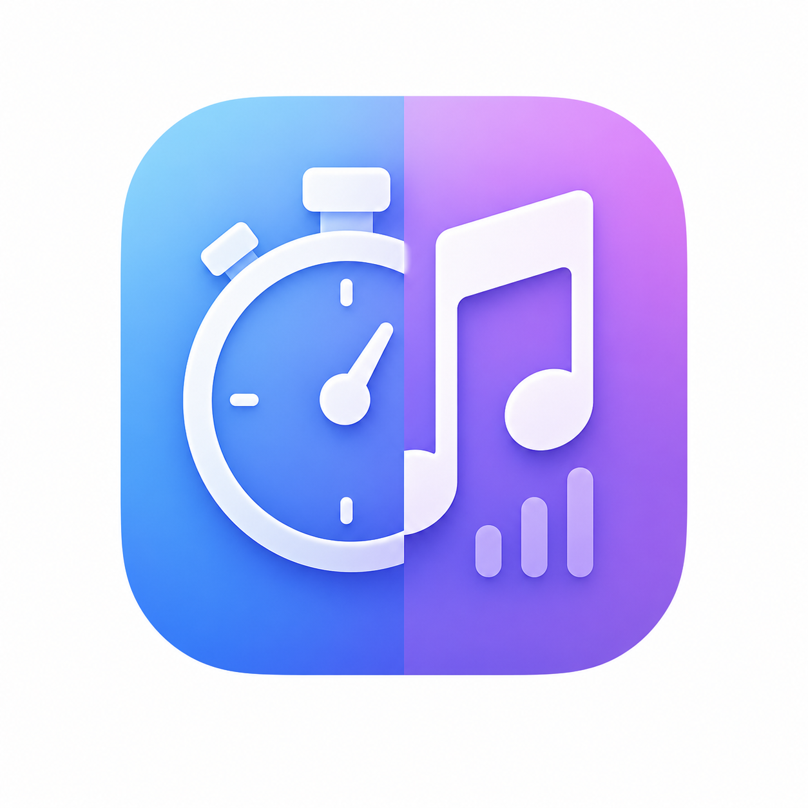

# TPlayer

Timer and local music player

<!-- PROJECT SHIELDS -->

[![Forks][forks-shield]][forks-url]
[![Stargazers][stars-shield]][stars-url]
[![Issues][issues-shield]][issues-url]
[![MIT License][license-shield]][license-url]
[![LinkedIn][linkedin-shield]][linkedin-url]

<!-- PROJECT LOGO -->
<br />

<p align="center">
  <a href="https://github.com/BaiQiuxin/Timer-Player/">
    
  </a>

  <h3 align="center">Timer & Player</h3>
  <p align="center">
    A simple app implemented with PyQt5, which accomplishs a timer and local music player.
    <br />
    <a href="https://github.com/BaiQiuxin/Timer-Player"><strong>Documentation »</strong></a>
    <br />
    <br />
    <a href="https://github.com/BaiQiuxin/Timer-Player">Check Demo</a>
    ·
    <a href="https://github.com/BaiQiuxin/Timer-Player/issues">Report Bug</a>
    ·
    <a href="https://github.com/BaiQiuxin/Timer-Player/issues">New Features</a>
  </p>

</p>

## Table of Contents

- [TPlayer](#tplayer)
  - [Table of Contents](#table-of-contents)
    - [Quick Start](#quick-start)
      - [Environment](#environment)
      - [Install](#install)
    - [File Tree](#file-tree)
    - [Implement](#implement)
      - [Join our community](#join-our-community)
    - [Version Control](#version-control)
    - [Author](#author)
    - [License](#license)
    - [Acknowledgments](#acknowledgments)

### Quick Start

#### Environment

1. Python 3.14
2. PyQt5 5.15.11

#### Install

1. Clone the repo
2. Put your audio files in `./data/song` and album cover images with the same names as your audio files in `./data/thumbnail`
3. Run `.\run.bat`

```sh
git clone https://github.com/BaiQiuxin/Timer-Player.git
```

### File Tree

eg:

```sh

MusicPlayer
├─ initialize.py
├─ LICENSE
├─ player.ini
├─ player.py
├─ README.md
├─ run.bat
├─ timer_text.txt
├─ images
│  └─ logo.png
└─ data
   ├─ thumbnail
   │  ├─ song1.png
   │  └─ song2.png
   └─ song
      ├─ song1.mp3
      └─ song2.mp3

```

### Implement

Clone and run.

#### Join our community

Contributions make the open source community a fantastic place to learn, inspire, and create. Any contributions you make are **Highly appreciated**.

1. Fork the Project
2. Create your Feature Branch (`git checkout -b feature/AmazingFeature`)
3. Commit your Changes (`git commit -m 'Add some AmazingFeature'`)
4. Push to the Branch (`git push origin feature/AmazingFeature`)
5. Open a Pull Request

### Version Control

This project uses Git for version control. You can view the currently available versions in the repository.

### Author

[Me](https://github.com/BaiQiuxin) and this is my [email](baiqiuxin@outlook.com)

### License

This project is licensed under the MIT License, check [LICENSE](https://github.com/BaiQiuxin/Timer-Player/LICENSE)

### Acknowledgments

Sincere thanks to [Tsoding Daily](https://www.youtube.com/@TsodingDaily) for inspiring this project.He's a great programmer and please make sure to check out his [youtube](https://www.youtube.com/@TsodingDaily) and [github account](https://github.com/tsoding).
And thanks shaojintian for this [README template](https://github.com/shaojintian/Best_README_template)

<!-- links -->
[forks-shield]: https://img.shields.io/github/forks/BaiQiuxin/Timer-Player.svg
[forks-url]: https://github.com/BaiQiuxin/Timer-Player/network/members
[stars-shield]: https://img.shields.io/github/stars/BaiQiuxin/Timer-Player.svg
[stars-url]: https://github.com/BaiQiuxin/Timer-Player/stargazers
[issues-shield]: https://img.shields.io/github/issues/BaiQiuxin/Timer-Player.svg
[issues-url]: https://github.com/BaiQiuxin/Timer-Player/issues
[license-shield]: https://img.shields.io/github/license/BaiQiuxin/Timer-Player
[license-url]: https://github.com/BaiQiuxin/Timer-Player/blob/master/LICENSE
[linkedin-shield]: https://img.shields.io/badge/-LinkedIn-black.svg&logo=linkedin&colorB=555
[linkedin-url]: https://linkedin.com/
